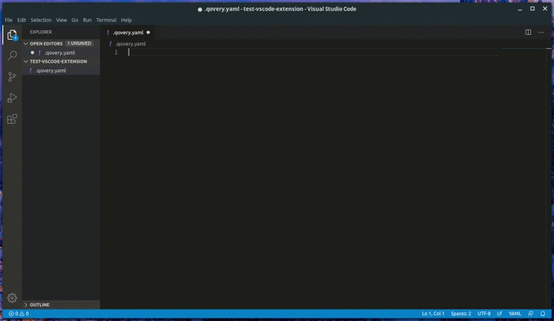

# Qovery Extension
Qovery Extension makes it easy to edit Qovery yaml specification files inside vscode.

Available directly on the Marketplace: https://marketplace.visualstudio.com/items?itemName=qovery.vscode-qovery-extension

## Demo 

## Usage
Open a file that end with .qovery.yml :)

## Compatibility
This extension support vscode at version `^1.25.0`.

## Dependency

This plugin use the [YAML](https://marketplace.visualstudio.com/items?itemName=redhat.vscode-yaml) extension created by Redhat.

## Contribution

Author: [Alexis Viscogliosi](https://github.com/alexisvisco)
